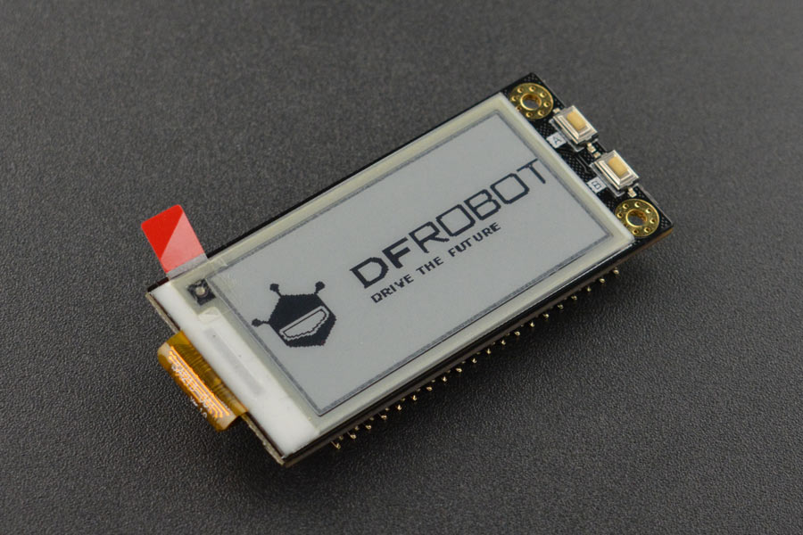

# DFRobot_RPi_Eink_Display
- [中文版](./README_CN.md)

This Raspberry Pi e-ink display module comes with a 2.13" screen with a resolution of 250×122, adopting SPI interface to communicate with Raspberry Pi. It leads out the pins on Raspberry Pi, so there would be no conflicts if you need to use the e-ink display and Raspberry Pi’s pins at the same time. The display supports custom font. There are two patch touch switches on the module for expanding more applications. This e-ink display features small size, compact layout, plug and play, and low power consumption. It can provide clear display even in sunlight. When powered off, the e-ink display will continue to display the last screen. Since it will take a long time for the display to refresh fully, we don’t recommend using the product in the application that needs frequent refreshing to display data.



## Product Link（https://www.dfrobot.com/product-1866.html)

SKU： DFR0591： 2.13" e-ink Display Module for Raspberry Pi 4B/3B+/Zero W

## Table of Contents

- [Summary](#Summary)
- [Installation](#Installation)
- [Methods](#Methods)
- [Compatibility](#Compatibility)
- [History](#History)
- [Credits](#Credits)

## Summary

   This is a Python library used to drive the DFRobot Raspberry Pi e-ink display module on the Raspberry Pi.

## Installation

To use the library, first download it to the Raspberry Pi.

```
git clone https://github.com/DFRobot/DFRobot_Eink_RPi_Display
```

Then open the example folder. Use the command:

```python
python display_xxx.py
```
Run the sample program.

## Methods

```python
'''!
  @brief Initialize and obtain the ID of the Raspberry Pi e-ink screen
'''
def begin(self):

'''!
  @brief Manually set the version number of the screen
'''
def set_version(self, version):

'''!
  @brief Get the ID of the e-ink screen
'''  
def read_id(self):

'''!
  @brief Set the ASCII font format
  @param fonts Font type
'''
def set_fonts(self, fonts):

'''!
  @brief init with fonts file
  @param obj Font file
'''   
def set_ex_fonts(self, obj):

'''!
  @brief Enable or disable mode fonts
  @param opt True/False
'''      
def set_enable_default_fonts(self, opt):

'''!
  @brief Set the format of the extended font
  @param width Font width
  @param height Font height
'''      
def set_ex_fonts_fmt(self, width, height):

'''!
  @brief  Set the ASCII font format
  @param fonts  Font type
'''     
def set_fonts(self, fonts):

'''!
  @brief init with fonts file
  @param obj Font file
'''        
def set_ex_fonts(self, obj):

'''!
  @brief Enable or disable mode fonts
  @param opt True/False
'''        
def set_enable_default_fonts(self, opt):

'''!
  @brief Set the format of the extended font
  @param width Font width
  @param height Font height
'''    
def set_ex_fonts_fmt(self, width, height):

'''!
  @brief Set the line width
'''        
def set_line_width(self, w):

'''!
  @brief Set the text format
  @param size Font size
  @param color Font color
  @param background Font background color
  @param interval_row Interval between font rows
  @param interval_col Interval between font columns
'''        
def set_text_format(self, size, color, background, interval_row=2, interval_col=0):

'''!
  @brief Set the cursor position
  @param x  x-coordinate
  @param y y-coordinate
'''       
def set_text_cursor(self, x, y):

'''!
  @brief Set the bitmap size
  @param size Bitmap size
'''        
def set_bitmap_size(self, size):

'''!
  @brief Set bitmap display format
  @param fmt Format configuration
'''   
def set_bitmap_fmt(self, fmt):

'''!
  @brief Set font
  @param obj font
'''       
def set_ex_fonts(self, obj):

'''!
  @brief Set the width and height of the font
  @param width Font width
  @param height Font height
'''        
def set_ex_fonts_fmt(self, width, height):

'''!
  @brief Set the default font
  @param opt Font type
'''       
def set_enable_default_fonts(self, opt):

'''!
  @brief  Draw a point on the screen at (x,y) coordinate
  @param x x-axis coordinate
  @param y y-axis coordinate
  @param color  Color
'''        
def pixel(self, x, y, color):

'''!
  @brief Display a character on the screen
  @param ch ASCII code of the character
'''        
def write_one_char(self, ch):

'''!
  @brief Display a string on the screen
  @param s String
'''        
def print_str(self, s):

'''!
  @brief Display a string on the screen and move to the next line
  @param s String 
'''        
def print_str_ln(self, s):

'''!
  @brief Draw a vertical line
  @param x x-axis coordinate
  @param y y-axis coordinate
  @param h Line length
  @param color Color
'''
def vertical_line(self, x, y, h, color):

'''!
  @brief Draw a horizontal line
  @param x x-axis coordinate
  @param y y-axis coordinate
  @param w line length
  @param color color
'''
def horizontal_line(self, x, y, w, color):

'''!
  @brief Draw a straight line
  @param x  starting x-axis coordinate of the line
  @param y starting y-axis coordinate of the line
  @param x1 ending x-axis coordinate of the line
  @param y1 ending y-axis coordinate of the line
  @param color Color
'''
def line(self, x, y, x1, y1, color):

'''!
  @brief Draw a hollow triangle
  @param x x-coordinate of the first point of the triangle
  @param y y-coordinate of the first point of the triangle
  @param x1 x-coordinate of the second point of the triangle
  @param y1 y-coordinate of the second point of the triangle
  @param x2 x-coordinate of the third point of the triangle
  @param y2 y-coordinate of the third point of the triangle
  @param color Color
'''
def hollow_triangle(self, x, y, x1, y1, x2, y2, color):

'''!
  @brief Draw a filled triangle
  @param x x-coordinate of the first point of the triangle
  @param y y-coordinate of the first point of the triangle
  @param x1 x-coordinate of the second point of the triangle
  @param y1 y-coordinate of the second point of the triangle
  @param x2 x-coordinate of the third point of the triangle
  @param y2 y-coordinate of the third point of the triangle
  @param color Color
'''
def filled_triangle(self, x, y, x1, y1, x2, y2, color):

'''!
  @brief Draw a hollow rectangle
  @param x x-coordinate of the starting point of the rectangle
  @param y y-coordinate of the starting point of the rectangle
  @param w Rectangle width 
  @param h Rectangle height
  @param color Color
'''
def hollow_rect(self, x, y, w, h, color):

'''!
  @brief Draw a solid rectangle
  @param x x-coordinate of the starting point of the rectangle
  @param y y-coordinate of the starting point of the rectangle
  @param w Rectangle width 
  @param h Rectangle height
  @param color Color
'''
def filled_rect(self, x, y, w, h, color):

'''!
  @brief Helper function for drawing a hollow circle
  @param x X-coordinate of the center of the circle
  @param y Y-coordinate of the center of the circle
  @param r Radius of the circle
  @param quadrant Used to indicate which quadrant of the circle to draw
  @param color Color
'''
def hollow_circle_helper(self, x, y, r, quadrant, color):

'''!
  @brief Draw a hollow circle
  @param x X-coordinate of the center of the circle
  @param y Y-coordinate of the center of the circle
  @param r Radius of the circle
  @param color Color
'''
def hollow_circle(self, x, y, r, color):

'''!
  @brief Helper function for drawing a solid circle
  @param x X-coordinate of the center of the circle
  @param y Y-coordinate of the center of the circle
  @param r Radius of the circle
  @param quadrant Used to indicate which quadrant of the circle to draw
  @param color Color
'''
def filled_circle_helper(self, x, y, r, quadrant, color):

'''!
  @brief Draw a solid circle
  @param x X-coordinate of the center of the circle
  @param y Y-coordinate of the center of the circle
  @param r Radius of the circle
  @param color Color
'''
def filled_circle(self, x, y, r, color):

'''!
  @brief Draw a hollow rounded rectangle
  @param x x-coordinate of the starting point of the rectangle
  @param y y-coordinate of the starting point of the rectangle
  @param w Rectangle width 
  @param h Rectangle height
  @param r Radius of the circle
  @param color Color
'''
def hollow_rounded_rectangle(self, x, y, w, h, r, color):

'''!
  @brief Draw a solid rounded rectangle
  @param x x-coordinate of the starting point of the rectangle
  @param y y-coordinate of the starting point of the rectangle
  @param w Rectangle width 
  @param h Rectangle height
  @param r Radius of the circle
  @param color Color
'''
def filled_rounded_rectangle(self, x, y, w, h, r, color):

'''!
  @brief Draw a bitmap
  @param x Starting x-coordinate of the bitmap
  @param y Starting y-coordinate of the bitmap
  @param bitmap  Bitmap array
  @param w Bitmap width 
  @param h Bitmap height 
  @param color Bitmap color 
  @param background Bitmap background color 
'''
def bitmap(self, x, y, bitmap, w, h, color, background):

'''!
  @brief Send the prepared screen image buffer to the e-ink screen for display
  @param mode: Display mode, FULL: full screen refresh, PART: partial refresh
'''
def flush(self, mode):

'''!
  @brief Draw a bitmap
  @param x Starting x-coordinate of the bitmap
  @param y Starting y-coordinate of the bitmap
'''        
def start_draw_bitmap_file(self, x, y):

'''!
  @brief Move the bitmap data buffer to the screen image buffer according to the rules
  @param buf Bitmap data buffer to be sent
'''
def bitmap_file_helper(self, buf):

'''!
  @brief Send out the prepared screen image buffer and display the bitmap on the e-ink 
'''
def end_draw_bitmap_file(self):

'''!
  @brief Clear the content displayed on the e-ink screen
'''
def clear_screen(self):
    
```

## Compatibility

- RaspberryPi Version

| Board        | Work Well | Work Wrong | Untested | Remarks |
| ------------ | :-------: | :--------: | :------: | :-----: |
| RaspberryPi2 |           |            |    √     |         |
| RaspberryPi3 |           |            |    √     |         |
| RaspberryPi4 |     √     |            |          |         |

* Python Version

| Python  | Work Well | Work Wrong | Untested | Remarks |
| ------- | :-------: | :--------: | :------: | ------- |
| Python2 |     √     |            |          |         |
| Python3 |     √     |            |          |         |

## History

- 2023/02/20 - Version 1.0.0 


## Credits

Written by fengli(li.feng@dfrobot.com), 2022. (Welcome to our [website](https://www.dfrobot.com/))
