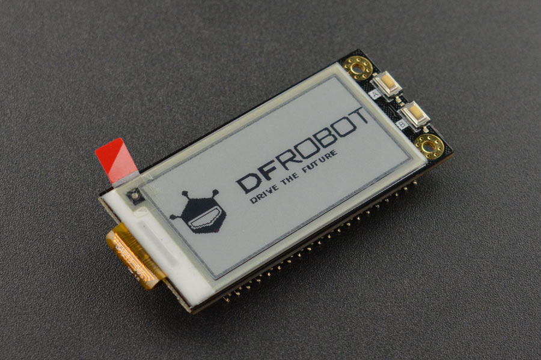

# DFRobot_RPi_Eink_Display
- [English Version](./README.md)

这款树莓派墨水屏显示器模块，搭载一块2.13寸250×122分辨率电子墨水屏，采用SPI接口与树莓派通信。
该模块将树莓派的引脚引出，使用墨水屏的同时，不影响你使用树莓派引脚。该墨水屏可以自定义字体，
通过ttf文件可以定制宋体、楷体、黑体等多种字体。另外墨水屏显示器模块上增加两个贴片触摸开关，
方便扩展更多应用。该墨水屏体积小巧，布局紧凑，即插即用，具有低功耗，阳光下可清晰显示，
断电后保持最后一屏内容等特点。由于墨水屏全局刷新时间较长，不建议用于频繁动态刷新显示数据的场合。


## 产品链接（https://www.dfrobot.com.cn/goods-1961.html)
    SKU:  DFR0591： 树莓派4B/3B+/zero w 2.13英寸黑白墨水屏

## 目录

* [概述](#概述)
* [库安装](#库安装)
* [方法](#方法)
* [兼容性](#兼容性y)
* [历史](#历史)
* [创作者](#创作者)

## 概述

   用于在树莓派上驱动 DFRobot Raspberry Pi E-ink Display Module 的 Python 库 。


## 库安装
要使用库，请首先下载该库到树莓派，然后打开例程文件夹。使用命令
```python
python display_xxx.py
```
来执行示例程序。

## Methods

```python
'''!
  @brief 初始化获取树莓派墨水屏的ID
'''
def begin(self):

'''!
  @brief 手动设置屏幕的版本号
'''
def set_version(self, version):

'''!
  @brief 用户获取墨水屏的ID
'''  
def read_id(self):

'''!
  @brief 设置ascii码的字体格式
  @param fonts 字体类型
'''
def set_fonts(self, fonts):

'''!
  @brief init with fonts file
  @param obj 字体文件
'''   
def set_ex_fonts(self, obj):

'''!
  @brief 设置是否使能模式字体
  @param opt True/False
'''      
def set_enable_default_fonts(self, opt):

'''!
  @brief 设置扩展字体的格式
  @param width 字体宽度
  @param height 字体高度
'''      
def set_ex_fonts_fmt(self, width, height):

'''!
  @brief 设置ascii码的字体格式
  @param fonts 字体类型
'''     
def set_fonts(self, fonts):

'''!
  @brief init with fonts file
  @param obj 字体文件
'''        
def set_ex_fonts(self, obj):

'''!
  @brief 设置是否使能模式字体
  @param opt True/False
'''        
def set_enable_default_fonts(self, opt):

'''!
  @brief 设置扩展字体的格式
  @param width 字体宽度
  @param height 字体高度
'''    
def set_ex_fonts_fmt(self, width, height):

'''!
  @brief 设置线段的宽度
'''        
def set_line_width(self, w):

'''!
  @brief 设置文本格式
  @param size 字体大小
  @param color 字体颜色
  @param background 字体的背景色
  @param interval_row 字体行之间的间隔
  @param interval_col 字体列之间的间隔
'''        
def set_text_format(self, size, color, background, interval_row=2, interval_col=0):

'''!
  @brief 设置光标位置
  @param x x轴坐标
  @param y y轴坐标
'''       
def set_text_cursor(self, x, y):

'''!
  @brief 设置位图的尺寸
  @param size 位图的大小
'''        
def set_bitmap_size(self, size):

'''!
  @brief 设置位图显示格式
  @param fmt 格式配置
'''   
def set_bitmap_fmt(self, fmt):

'''!
  @brief 设置字体
  @param obj 字体
'''       
def set_ex_fonts(self, obj):

'''!
  @brief 设置字体的宽度和高度
  @param width 字体的宽度
  @param height 字体的高度
'''        
def set_ex_fonts_fmt(self, width, height):

'''!
  @brief 设置默认的字体
  @param opt 字体类型
'''       
def set_enable_default_fonts(self, opt):

'''!
  @brief 在屏幕(x,y)坐标处画一个点
  @param x x轴坐标
  @param y y轴坐标
  @param color 颜色
'''        
def pixel(self, x, y, color):

'''!
  @brief 在屏幕上显示一个字符
  @param ch 字符的ascii码
'''        
def write_one_char(self, ch):

'''!
  @brief 在屏幕上显示字符串
  @param s 字符串
'''        
def print_str(self, s):

'''!
  @brief 在屏幕上显示字符串,并换行
  @param s 字符串
'''        
def print_str_ln(self, s):

'''!
  @brief 画一条垂直线
  @param x x轴坐标
  @param y y轴坐标
  @param h 线长
  @param color 颜色
'''
def vertical_line(self, x, y, h, color):

'''!
  @brief 画一条水平线
  @param x x轴坐标
  @param y y轴坐标
  @param w 线长
  @param color 颜色
'''
def horizontal_line(self, x, y, w, color):

'''!
  @brief 画一条直线
  @param x 直线的x轴起始坐标
  @param y 直线的y轴起始坐标
  @param x1 直线的x轴结束坐标
  @param y1 直线的y轴结束坐标
  @param color 颜色
'''
def line(self, x, y, x1, y1, color):

'''!
  @brief 画一个空心三角形
  @param x 三角形第一个点的x坐标
  @param y 三角形第一个点的y坐标
  @param x1 三角形第二个点的x坐标
  @param y1 三角形第二个点的y坐标
  @param x2 三角形第三个点的x坐标
  @param y2 三角形第三个点的y坐标
  @param color 颜色
'''
def hollow_triangle(self, x, y, x1, y1, x2, y2, color):

'''!
  @brief 画一个实心三角形
  @param x 三角形第一个点的x坐标
  @param y 三角形第一个点的y坐标
  @param x1 三角形第二个点的x坐标
  @param y1 三角形第二个点的y坐标
  @param x2 三角形第三个点的x坐标
  @param y2 三角形第三个点的y坐标
  @param color 颜色
'''
def filled_triangle(self, x, y, x1, y1, x2, y2, color):

'''!
  @brief 画一个空心矩形
  @param x 矩形起点x坐标
  @param y 矩形起点y坐标
  @param w 矩形宽度
  @param h 矩形高度
  @param color 颜色
'''
def hollow_rect(self, x, y, w, h, color):

'''!
  @brief 画一个实心矩形
  @param x 矩形起点x坐标
  @param y 矩形起点y坐标
  @param w 矩形宽度
  @param h 矩形高度
  @param color 颜色
'''
def filled_rect(self, x, y, w, h, color):

'''!
  @brief 画空心圆辅助函数
  @param x 圆心的x坐标
  @param y 圆心的y坐标
  @param r 半径
  @param quadrant 用来表示是哪一个四分之一圆
  @param color 颜色
'''
def hollow_circle_helper(self, x, y, r, quadrant, color):

'''!
  @brief 画一个空心圆
  @param x 圆心的x坐标
  @param y 圆心的y坐标
  @param r 半径
  @param color 颜色
'''
def hollow_circle(self, x, y, r, color):

'''!
  @brief 画实心圆辅助函数
  @param x 圆心的x坐标
  @param y 圆心的y坐标
  @param r 半径
  @param quadrant 用来表示是哪一个四分之一圆
  @param color 颜色
'''
def filled_circle_helper(self, x, y, r, quadrant, color):

'''!
  @brief 画一个空心圆
  @param x 圆心的x坐标
  @param y 圆心的y坐标
  @param r 半径
  @param color 颜色
'''
def filled_circle(self, x, y, r, color):

'''!
  @brief 画一个空心圆角矩形
  @param x 矩形起点x坐标
  @param y 矩形起点y坐标
  @param w 矩形宽度
  @param h 矩形高度
  @param r 圆角的半径
  @param color 颜色
'''
def hollow_rounded_rectangle(self, x, y, w, h, r, color):

'''!
  @brief 画一个实心圆角矩形
  @param x 矩形起点x坐标
  @param y 矩形起点y坐标
  @param w 矩形宽度
  @param h 矩形高度
  @param r 圆角的半径
  @param color 颜色
'''
def filled_rounded_rectangle(self, x, y, w, h, r, color):

'''!
  @brief 画位图
  @param x  起点x坐标
  @param y  起点y坐标
  @param bitmap  位图数组
  @param w 位图的宽度
  @param h 位图的高度
  @param color 位图的颜色
  @param background 位图的背景色
'''
def bitmap(self, x, y, bitmap, w, h, color, background):

'''!
  @brief 把已经准备好的屏幕图像buffer发送出去,显示到墨水屏
  @param mode: 显示的模式FULL全屏刷新,PART:局部刷新
'''
def flush(self, mode):

'''!
  @brief 绘制位图
  @param x 位图起始x坐标
  @param y 位图起始y坐标
'''        
def start_draw_bitmap_file(self, x, y):

'''!
  @brief 将位图数据buffer按规则移到到屏幕图像buffer
  @param buf 待发送位图数据buffer
'''
def bitmap_file_helper(self, buf):

'''!
  @brief 把已经准备好的屏幕图像buffer发送出去,显示位图到墨水屏
'''
def end_draw_bitmap_file(self):

'''!
  @brief 清除墨水屏上显示的东西
'''
def clear_screen(self):
    
```


## 兼容性


| 主板         | 通过 | 未通过 | 未测试 | 备注 |
| ------------ | :--: | :----: | :----: | :--: |
| RaspberryPi2 |      |        |   √    |      |
| RaspberryPi3 |      |        |   √    |      |
| RaspberryPi4 |  √   |        |        |      |

* Python 版本

| Python  | 通过 | 未通过 | 未测试 | 备注 |
| ------- | :--: | :----: | :----: | ---- |
| Python2 |  √   |        |        |      |
| Python3 |  √   |        |        |      |

## History

- 2023/02/20 - 1.0.0 版本


## Credits

Written by fengli(li.feng@dfrobot.com), 2022. (Welcome to our [website](https://www.dfrobot.com/))
